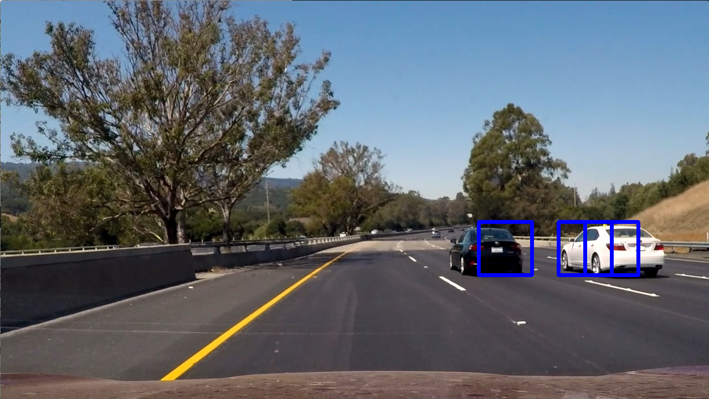

# **Vehicles Detection Project**
## Writeup / README

This is a summary of the work done to develop a processing pipeline for the vehicles detection project for the Udacity Self-Driving Car Nanodegree. The github repositroy of the project can be found [here](https://github.com/bmalnar/VehiclesDetectionSDCN)

More information can be found in the jupyter notebook provided, and here we only provide the high level overview of the pipeline. 

### Data loading and exploration

We load the data and visualize it in at the top of the notebook. There are 'car' and 'noncar' data provided by Udacity. 

We can see that the car images are mostly showing cars captured from behind, or slightly from the side. This is what we need for training in this case, because we typically see other vehicles on the highway from behind/side in the project video. For general case, we need more variety of angles. An example is shown below:


If we look at the images in the noncar distribution, we see images with road side and empty roads, which is typically what we see looking forward from the car. A typical example is shown below:


### Fucntions for feature extraction

We can extract three different types of features for this project:

* HOG features (function get_hog_features): histograms of oriented gradients computed separately for each channel in the image. If we have a color image(3 channels) we can decide whether to use all 3 channels or any combination of them. From the experiments performed for this project, HOG features seem to be more robust for the purpose of car detection
* Spatial features (function bin_spatial): here we attempt to recognize the car based on the template matching
* Color features (function color_hist): attempt to recognize the car based on the histogram of colors in the image

The importance of defining the feature vector is to get the pipeline that detects the cars robustly, but also the size of the vector should be looked at to ensure relatively fast detections (the lower the vector size, the faster the detection process). 

### Illustration of HOG 

Below we show how the HOG feature looks like for a car and a noncar image. These features can take a lot different look for different images, especially in the case of noncar images. For images of cars from behind, the HOG feature vector should be relatively robust. 

Car image:


Car HOG:


Noncar image:


Noncar HOG:


### Configuration of the feature extraction pipeline

We can run different experiments to pick up the best set of params for our applications. The following experiments were performed:

* Use a different combination of features. Using HOG should always be turned on because that brings the best results. For spatial and color histogram features, it was not clear that they contribute to the quality of the results. For that reason, they are turned off, which makes the size of the feature vector smaller. 
* Color space is eventually set to YCrCb. This has shown to be a good color space for HOG, and we are using all 3 channels and corresponding HOG features. 
* HOG params such as number of orientations, pixels per cell and cells per block are investigated, and the values listed below are shown to perform well. 

```
# Params for feature extraction
# Color space can be RGB, HSV, LUV, HLS, YUV, YCrCb
color_space = 'YCrCb' 
# Number of HOG orientations
orient = 11 
# Number of HOG pixels per cell
pix_per_cell = 16
# Number of HOG cells per block
cell_per_block = 2 
# HOG channel can be 0, 1, 2, or "ALL"
hog_channel = 'ALL' 
# Spatial binning dimensions
spatial_size = (16, 16) 
# Number of histogram bins
hist_bins = 32    
# Whether or not to use spatial features
spatial_feat = False 
# Whether or not to use color histogram features
hist_feat = False 
# Whether or not to use HOG features
hog_feat = True 
```

### Feature extraction

We separately extract car and noncar features, and generate appropriate labels, i.e. 0 and 1 for noncar and car images, respectively. Then we put the car and noncar vectors together and split them into training and test datasets. The feature data is scaled - this is probably not required if we use only the HOG feature data, but it is kept in for consistency. The scaler is fit using only the training data, and then used to scale both the training and test data separately. At this point, we are ready to train and test the classifier. 

### Training the SVM classifier

After feature extraction, we train the classifier. The time taken for training and and the test accuracy is listed in the notebook. Typically for different params setting in the feature extraction step, we get about 10 seconds of training time and 96-98 percent accuracy in the testing step. 

We investigate 3 different feature types for the pipeline (more information can be found in the notebook):

* HOG (histogram of oriented gradients)
* Color histogram
* Spatial/template feature

Eventually we decided to use only the HOG features, because it was not conclusive that the other two feature types contributed to the quality of the results. 

### Find cars in the input image

The function _find_cars_ finds cars in the image. The function implements the sliding window search, where the image is essentially divided into multiple overlapping windows and then each window is evaluated to check whether or not it contains the car. If it does, the window is added to the final return list. Eventually, the function returns the list of all the windows where the car was detected. 
The three important input parameters of the function are _ystart, ystop and scale_:

* _ystart_ and _ystop_ define where to start and where to stop looking at the car, respectively, looking at the vertical dimension of the image. We don't specify xstart and xstop for the horizontal dimension because we search the entire image horizontally. The parameters ystart the ystop allow us to skip searching the image at roughly the top-half where we don't expect to find any cars, and also to search only in certain parts of the image for certain sizes of the cars. For examples, the lower part of the image should contain cars that are closer to us and therefore appear larger in the image, while the part of the image near the middle should contain cars in the distance, which appear smaller in the image. 
* _scale_ defines whether to scale the image patch or not, and by how much. We typically need to scale the patch under investigation because we trained the classifier with images of fixed size, and the cars can appear smaller or larger than that in the image, depending on how far they are from us. 

Note that find_cars also contains the flag _return_all_rectangles_. If set to _True_, the function returns all the rectangles that were searched, so that we can visualize them and tune the parameters of our pipeline (e.g. in which part of the image should we specify which scale, to increase the detection performance).  

For the test image, we get the rectangles as shown below:



### Defining search patches

Now we need to experiment how to define search patches for the image, so that we look at the right place for the right scaling factor. We use the list called _step_config_ to define the y patches for the given scale. 

In the code below, we see that _stop_config_ contains the tuples of 4 numbers: the step between two consecutive horizontal patches, the starting coordinate of the first patch, the scale, and the number of patches. In the example in the next scale, we essentially use two patches of scale 1, the first starting at 400 and the second at 416. 

For different scales, we will define different step configs and then we put them all together into the final pipeline.

The picture below shows windows for scale = 1:


The picture below shows windows for scale = 1.5:


The picture below shows windows for scale = 2:


The picture below shows windows for scale = 3.5:


### Complete search function

The function _search_all_windows_ combines searching for different scales with different configuration steps. It returns the list of all detected windows for all scales. For the test image, we get the following image with rectangles:


### Heatmap

The fucntion _add_heat_hist_ creates the heatmap for the detected windows. In general, the function starts with zeros across the entire image, and looks at all the pixels in the image together with the windows where the cars are detected. For each pixel, the value is increased by one for each detected window that contains that pixel. Eventually, some pixels will have 0, some will have 1 (detected within the single window), but some will have values greater than 1 if contained within multiple windows. 

The function also has the flag use_hist, so that it can create the heatmap taking into account heatmaps of several previous frames. This helps the drawn bounding boxes to be more stable, because in each frame we don't typically have the same exact detections as in the previous frames (also because the cars are moving). 

For the test image, we get the following heatmap:


We can also choose to apply a certain threshold with the heatmap and only keep the values that are above the threshold. This helps especially if we use the history of heatmaps, i.e. heatmaps of several previous frames, but also to eliminate false positives. 

For the test image, we get the following heatmap with threshold:


### Convert heatmaps to labels

We use the function _labels_ from SciPy to convert heatmap to individual labels. Each "blob" in the heatmap gets its own label, which we can use to eventually draw bounding boxes.


For each label, we can now draw a rectangle, and that is what the function _draw_labeled_bboxes_ does. This helps us to smooth the edges of the labelled blobs in the figure above. 


### Processing pipeline

The processing pipeline defined in the function _process_frame_ performs 4 major steps:

* Implement the sliding window search for the cars in the image. This is done by practically dividing the input image into windows of different sizes/scales, and looking at each window for a car. If the car is found, the window is remembered, or otherwise it is discarded. We use a linear SVM classifier trained on the input data provided by Udacity. 
* Based on the windows detected, we create a heatmap of the image, where there is more "heat" in the areas where detections are achieved with larger confidence. 
* Based on the heatmap, we generate labelled blobs where the cars ar epresumably detected
* Finally, based on these labels we draw rectangles on top of the input image, so that we can visualize the quality of the detection. 

We tested the final processing pipeline on the six images provided in the test_images folder, with the following results:


### Discussion 

The resulting video shows that the pipeline performs relatively well for the purpose of detecting vehicles on the road, but the major issue is that there are often false positives especially on the left hand side of the video. These could be further eliminated by increasing the quality of the processing pipeline (for example if we could obtain more training data), or by further post processing steps. The latter is probably easier, especially since these false positives only appear for 1-2 frames, and can be easily detected and discarded. 

Comparing the results to some of the other experiments I did based on neural networks (such as SSD detector architectures or scene segmentation architectures such as ICNet or PSPnet), using HOG and SVM is probably inferior in terms of the quality of results. However, the nice thing about this experiment is that we get increasing knowledge of how classical computer vision approaches work, to better estimate what is possible and what is to be epxected. Not everything in the car needs to be based on deep learning, and having a variaty of tools to attack the problem can only be beenfitial. 

